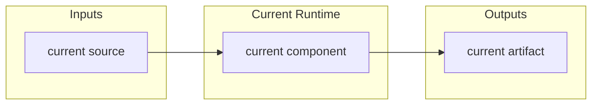
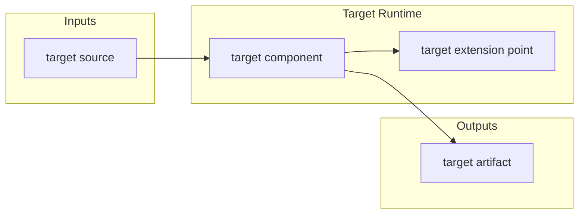

# SuperDev Agent Instructions

SuperDev is a spec / plan driven development standard. Agents should use it whenever they perform substantial development, refactoring, planning, or architecture work in a long-lived repository or module.

## Instruction Surfaces

This repository exposes the same standard through three surfaces:

- `AGENTS.md`: Codex and general agent instructions.
- `CLAUDE.md`: Claude Code instructions.
- `SKILL.md`: reusable Codex skill, invoked as `$superdev`.

Keep these surfaces conceptually aligned when the SuperDev standard changes.

## Core Rule

Development is gated by architecture clarity:

- Maintain repository-level `SPEC.md` and `PLAN.md`.
- Maintain module-level `<module>/SPEC.md` and `<module>/PLAN.md` for every long-lived module.
- Require every substantial `SPEC.md` to include both `Current Architecture` and `Target Architecture` Mermaid diagrams.
- Do not begin substantial production implementation until the target Mermaid architecture is clear.

Small one-off utilities, copy edits, typo fixes, and local experiments do not need their own module docs unless they become durable subsystems.

## Repository Docs

The repository root must maintain:

- `SPEC.md`: repository-wide architecture, boundaries, core concepts, data contracts, and module relationships.
- `PLAN.md`: repository-wide current status, milestones, completed work, remaining work, next steps, owners, acceptance criteria, risks, and verification evidence.

Each substantial long-lived module must maintain:

- `SPEC.md`: direction, scope, architecture, data contracts, boundaries, and design decisions.
- `PLAN.md`: current status, completed work, remaining work, owners, priority, milestones, acceptance criteria, risks, and verification evidence.

## SPEC.md Requirements

Each substantial `SPEC.md` should answer:

- What problem does this repository or module solve?
- What is in scope and out of scope?
- What are the main concepts and boundaries?
- What is the current architecture?
- What is the target architecture?
- What data contracts, schemas, APIs, or file layouts matter?
- How does it interact with other modules?

Every substantial `SPEC.md` must include:

````md
## Current Architecture



## Target Architecture


````

`Current Architecture` must describe the code that exists now. It is not a wishlist.

`Target Architecture` must describe the design the current work is moving toward. It should be clear enough to guide implementation decisions.

Prefer simple horizontal Mermaid diagrams. Avoid giant diagrams, decorative styling, and diagrams that hide module boundaries.

## PLAN.md Requirements

Each substantial `PLAN.md` should answer:

- What is already done?
- What is partially done?
- What is not started?
- What is the recommended next step?
- Who owns each class of work?
- What are the acceptance criteria?
- What risks or open questions remain?
- What verification evidence supports completed items?

Suggested sections:

- Current Status
- Milestones
- Next Steps
- Owners
- Acceptance Criteria
- Verification Log
- Risks / Open Questions
- Status Maintenance Rules

## Development Gate

Before substantial code changes:

- Read the root `SPEC.md` and `PLAN.md`.
- Read the relevant module `SPEC.md` and `PLAN.md` when the change touches a long-lived module.
- Confirm that each relevant `SPEC.md` has `Current Architecture` and `Target Architecture` Mermaid diagrams.
- Confirm that the `Target Architecture` matches the user's requested direction.

If there is no clear `Target Architecture` Mermaid diagram, or if the target diagram does not match the requested work, stop before production implementation. Update or discuss the target architecture first.

After substantial code changes:

- Update `Current Architecture` in the relevant `SPEC.md` if the implemented architecture changed.
- Update `Target Architecture` if the intended direction changed or if the target has been reached and needs to be reset.
- Update `PLAN.md` with completed work, remaining work, next steps, acceptance criteria, risks, and verification evidence.

## Spec / Plan Coupling

Specs and plans must stay in sync:

- If `SPEC.md` adds a concept, field, boundary, component, or phase, update `PLAN.md`.
- If `PLAN.md` marks a milestone complete, update the relevant `SPEC.md` current-status section.
- If implementation deviates from `SPEC.md`, either adjust implementation or update the spec with the new decision.
- Do not leave a plan item marked done unless code, docs, and verification evidence support it.

## Working Rule

Architecture first, then implementation. A substantial change should not begin until the relevant target Mermaid architecture is understood well enough to guide the work.
