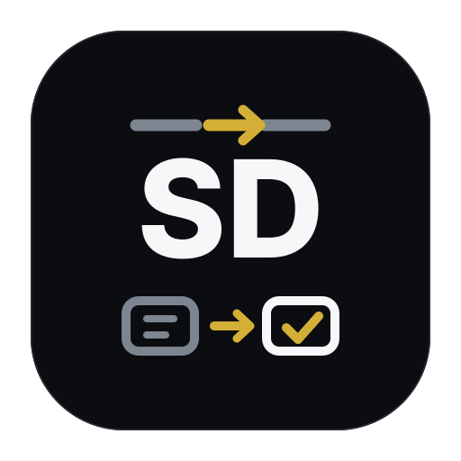
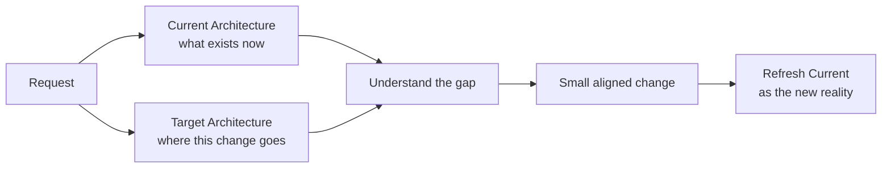
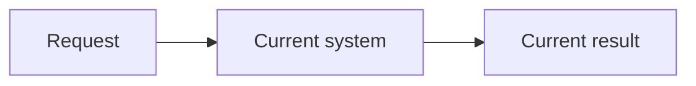
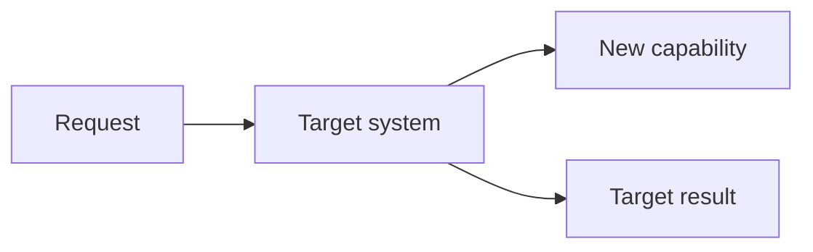

<div align="center">



# SuperDev

### Keep AI coding agents on architecture with two Mermaid diagrams

**Current Architecture explains what exists. Target Architecture explains what changes. Then let the model work.**

[](https://github.com/fightheyyy/SuperDev)


[中文](./README.md) · [30-second idea](#the-30-second-idea) · [Why only two diagrams](#why-only-two-diagrams) · [Quick start](#quick-start)

</div>

---

SuperDev is a lightweight software architecture workflow for **AI coding agents, Codex, and Claude Code**.

As models get stronger, the scarce input is no longer another layer of microscopic constraints. It is accurate architectural context. SuperDev's design idea can be reduced to two readable Mermaid maps:

- **Current Architecture**: how the system actually works now.
- **Target Architecture**: how the requested change should leave it working.

When both maps are clear, an agent can understand the gap, implement the change, and update Current to reflect the new reality. The repository's existing `SPEC.md` / `PLAN.md` rules organize and synchronize that information, but Current / Target Architecture remains the context that actually helps the model understand the system.

## The 30-second idea



The diagrams give a strong model shared context. They do not dictate how to write every line; they show what the agent is protecting and what it is changing.

## Why only two diagrams

| Architecture map | Question it answers | Most important rule |
|---|---|---|
| Current Architecture | How does the system actually work now? | Match the code; do not draw a wish |
| Target Architecture | Where should this change take the system? | Show the current direction, not an endless roadmap |

The gap between Current and Target is the problem the agent needs to solve. This is shorter and more stable than adding more prompt rules, and easier for humans and models to review together.

## Quick start

### Codex

Install the repository as a local skill:

```bash
git clone https://github.com/fightheyyy/SuperDev.git ~/.codex/skills/superdev
```

Then invoke it in a task:

```text
$superdev implement this change while keeping current and target architecture aligned.
```

### Claude Code and other coding agents

- Merge the guidance in [`CLAUDE.md`](./CLAUDE.md) into your project's existing `CLAUDE.md`.
- Merge the guidance in [`AGENTS.md`](./AGENTS.md) into your project's existing `AGENTS.md`.

The corresponding coding agent only needs access to these instructions.

## Minimal template

Use this minimal structure directly in your project's `SPEC.md`:

````md
# Architecture

## Current Architecture



## Target Architecture


````

## Make Mermaid useful

- Prefer `flowchart LR` so change reads from left to right.
- Show logical components and important relationships, not file trees, method names, or trace logs.
- Keep labels short and the whole map scannable in seconds.
- Current is reality, not aspiration. Target is the direction of this change, not an unlimited roadmap.
- Keep the layouts comparable and highlight only the relationships that actually change.

The goal is not to capture every detail. It is to make the system change readable at a glance.

## When to use it

Use SuperDev for:

- long-lived repositories and modules;
- features that change component boundaries, data flow, or dependency direction;
- refactors, migrations, platforms, adapters, and runtime changes;
- systems that another human or agent will need to understand later.

Skip it for:

- typos, copy edits, and dependency bumps;
- small bug fixes that do not change logical structure;
- one-off scripts and throwaway experiments.

## Repository contents

- [`SKILL.md`](./SKILL.md): installable Codex skill.
- [`AGENTS.md`](./AGENTS.md): instructions for Codex and general coding agents.
- [`CLAUDE.md`](./CLAUDE.md): instructions for Claude Code.
- [`agents/openai.yaml`](./agents/openai.yaml): Codex skill discovery metadata.

## Pair it with SuperGoal

[SuperGoal](https://github.com/fightheyyy/SuperGoal) clarifies a rough request. SuperDev keeps implementation aligned with the architecture:

```text
rough request → SuperGoal clarifies the goal → SuperDev aligns Current / Target → implementation
```

If you also think strong models need clearer context rather than more process, star the repository and help more builders discover a lighter approach to AI-assisted engineering.
