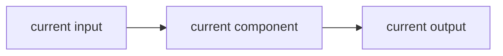
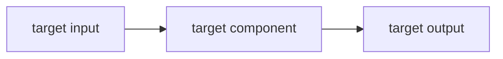

<div align="center">


# SuperDev

### A spec / plan gate for AI-assisted engineering

**Coding agents need an architecture gate.**

[Why](#why) · [Core Loop](#core-loop) · [What It Enforces](#what-it-enforces) · [Quick Start](#quick-start) · [Repo Contents](#repo-contents)

</div>

---

> What if your coding agent had to understand the current architecture and the target architecture before touching production code?

Better prompts help, but long-lived repository work fails when the agent starts coding before it knows what architecture it is preserving or moving toward.

SuperDev is a lightweight engineering standard for long-lived AI-assisted repositories.

It makes the agent keep architecture, implementation, execution plan, and verification evidence in sync through `SPEC.md` and `PLAN.md` files. The point is not more documentation for its own sake. The point is to stop coding agents from drifting into broad rewrites, stale plans, and "it worked once" changes that nobody can explain later.

SuperDev's core rule is simple:

> **No substantial implementation before the target architecture is clear.**

---

## Why

AI coding agents are fast enough to create technical debt before a human notices. The failure mode is usually not "the agent cannot write code". The failure mode is that the agent starts coding before it has a stable contract for what the system is, where the boundary is, and what the change is supposed to move toward.

| Failure mode | SuperDev answer |
|---|---|
| The agent starts coding from a vague request | Require current and target architecture before substantial implementation |
| README, plans, and code disagree | Keep `SPEC.md`, `PLAN.md`, and implementation synchronized |
| A small change turns into a broad rewrite | Make scope, boundaries, non-goals, and acceptance criteria explicit |
| Long-lived modules become tribal knowledge | Give every durable module its own architecture and execution state |
| "Done" means only "files changed" | Require verification evidence in the plan |

---

## Core Loop

```text
request
  -> identify repo / module boundary
  -> read SPEC.md + PLAN.md
  -> verify Current Architecture
  -> clarify Target Architecture
  -> implement the smallest matching change
  -> update SPEC.md / PLAN.md
  -> record verification evidence
```

SuperDev turns architecture into a live contract:

- `SPEC.md` says what the system is, what is in scope, what the current architecture is, and what the target architecture is.
- `PLAN.md` says what is done, what is next, who owns it, what risks remain, and what evidence proves progress.
- Mermaid diagrams make the current and target shape visible enough for a coding agent to reason about.

---

## What It Enforces

| Area | Rule |
|---|---|
| Root repository | Maintain root `SPEC.md` and `PLAN.md` for repository-wide architecture and execution state |
| Durable modules | Maintain `<module>/SPEC.md` and `<module>/PLAN.md` for every long-lived subsystem |
| Current architecture | `SPEC.md` must show what the current code actually implements |
| Target architecture | `SPEC.md` must show the architecture the current work is moving toward |
| Implementation gate | If the target Mermaid diagram is missing, vague, or inconsistent, stop before production code |
| Plan hygiene | Completed work must be backed by code, docs, and verification evidence |

Minimum `SPEC.md` shape:

````md
## Current Architecture



## Target Architecture


````

Keep diagrams simple and truthful. `Current Architecture` is reality, not aspiration. `Target Architecture` is the next intended design, not an unlimited vision board.

---

## Quick Start

Use it in Codex:

```text
$superdev
```

For repositories that should always follow this standard, copy or adapt:

- `AGENTS.md` for Codex and general coding agents
- `CLAUDE.md` for Claude Code

Then maintain:

```text
docs/SPEC.md
docs/PLAN.md
<module>/SPEC.md
<module>/PLAN.md
```

Use SuperDev when the work touches durable architecture, shared runtime behavior, long-lived modules, benchmark systems, role/skill systems, adapters, dashboards, replay/eval infrastructure, or anything that future agents will need to understand again.

Do not use it for tiny typo fixes, one-off scripts, throwaway local experiments, or copy edits unless they become durable subsystems.

---

## Repo Contents

- `SKILL.md`: the reusable Codex skill. Invoke it as `$superdev`.
- `AGENTS.md`: instructions for Codex and general coding agents.
- `CLAUDE.md`: instructions for Claude Code.
- `agents/openai.yaml`: Codex skill metadata for UI discovery.

The `agents/` folder is not a multi-agent implementation. It is part of the Codex skill packaging format.

---

## SuperDev + SuperGoal

SuperDev pairs naturally with [SuperGoal](https://github.com/fightheyyy/SuperGoal):

- **SuperGoal** turns rough requests into acceptance-first goal contracts.
- **SuperDev** makes sure repository work stays aligned with architecture and plan state.

Together:

```text
rough request
  -> SuperGoal acceptance contract
  -> SuperDev architecture gate
  -> narrow implementation
  -> verification evidence
```
