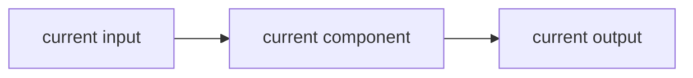
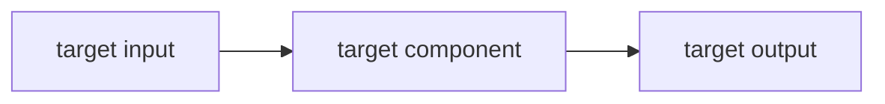

<div align="center">


# SuperDev

### 给 AI 辅助工程用的 SPEC / PLAN 架构门禁

**Coding agent 需要一个 architecture gate。**

[English README](./README.en.md) · [为什么需要](#为什么需要) · [核心流程](#核心流程) · [它约束什么](#它约束什么) · [快速开始](#快速开始) · [仓库内容](#仓库内容)

</div>

---

> 如果 coding agent 在改生产代码之前，必须先说清楚当前架构和目标架构，会怎么样？

更好的 prompt 有用，但长期仓库开发真正容易失控的地方，是 agent 还没搞清楚自己要保护什么架构、要走向什么架构，就已经开始改代码。

SuperDev 是一套给长期 AI-assisted repository 用的轻量工程标准。

它要求 agent 通过 `SPEC.md` 和 `PLAN.md` 同步维护架构、实现、执行计划和验证证据。目的不是为了多写文档，而是防止 coding agent 漂到大重构、过期计划和“这次刚好跑通但没人解释得清”的改动里。

SuperDev 的核心规则很简单：

> **目标架构没说清楚之前，不做实质生产实现。**

---

## 为什么需要

AI coding agent 写代码太快，快到人还没发现，它已经开始制造技术债。失败模式通常不是“agent 不会写代码”，而是它在没有稳定合同之前就开始动手：系统是什么、边界在哪里、这次修改要把系统带向哪里，都没定义清楚。

| 失败模式 | SuperDev 的做法 |
|---|---|
| agent 从一个模糊需求直接开始写代码 | 实质实现前必须确认 Current / Target Architecture |
| README、计划和代码互相打架 | 让 `SPEC.md`、`PLAN.md` 和实现保持同步 |
| 一个小改动变成大重构 | 显式写出范围、边界、非目标和验收标准 |
| 长期模块变成口口相传的知识 | 每个 durable module 都有自己的架构和执行状态 |
| “完成”只代表文件变了 | 在 plan 里记录验证证据 |

---

## 核心流程

```text
需求
  -> 判断 repo / module 边界
  -> 读取 SPEC.md + PLAN.md
  -> 核对 Current Architecture
  -> 澄清 Target Architecture
  -> 做最小匹配实现
  -> 更新 SPEC.md / PLAN.md
  -> 记录验证证据
```

SuperDev 把架构变成一个 live contract：

- `SPEC.md` 说明系统是什么、范围是什么、当前架构是什么、目标架构是什么。
- `PLAN.md` 说明已经完成什么、下一步是什么、谁负责、风险是什么、什么证据证明进展有效。
- Mermaid 图让 current / target shape 足够可见，agent 才能围绕它做工程判断。

---

## 它约束什么

| 区域 | 规则 |
|---|---|
| 根仓库 | 维护根级 `SPEC.md` 和 `PLAN.md`，描述全局架构和执行状态 |
| 长期模块 | 每个长期子系统维护 `<module>/SPEC.md` 和 `<module>/PLAN.md` |
| 当前架构 | `SPEC.md` 必须描述当前代码实际实现的架构 |
| 目标架构 | `SPEC.md` 必须描述当前工作要走向的架构 |
| 实现门禁 | 如果目标 Mermaid 图缺失、模糊或和需求冲突，先停下来，不写生产代码 |
| 计划卫生 | 标记完成的工作必须有代码、文档和验证证据支撑 |

最小 `SPEC.md` 结构：

````md
## Current Architecture



## Target Architecture


````

图要简单、横向、真实。`Current Architecture` 是现实，不是愿景。`Target Architecture` 是当前开发方向，不是无限未来蓝图。

---

## 快速开始

在 Codex 里使用：

```text
$superdev
```

如果某个仓库希望长期遵守这套标准，可以复制或改写：

- `AGENTS.md`：给 Codex 和通用 coding agent 使用
- `CLAUDE.md`：给 Claude Code 使用

然后维护：

```text
docs/SPEC.md
docs/PLAN.md
<module>/SPEC.md
<module>/PLAN.md
```

适合使用 SuperDev 的场景：长期架构、共享 runtime、长期模块、benchmark、role / skill 系统、adapter、dashboard、replay / eval 基础设施，或者任何未来 agent 还要回来理解的东西。

小 typo、一次性脚本、临时实验和普通文案修改不需要上 SuperDev，除非它们开始变成 durable subsystem。

---

## 仓库内容

- `SKILL.md`：可复用 Codex skill，使用 `$superdev` 调用。
- `AGENTS.md`：给 Codex 和通用 coding agent 的说明。
- `CLAUDE.md`：给 Claude Code 的说明。
- `agents/openai.yaml`：Codex skill UI 展示元数据。

`agents/` 目录不是多 agent 实现，它只是 Codex skill packaging 的一部分。

---

## SuperDev + SuperGoal

SuperDev 和 [SuperGoal](https://github.com/fightheyyy/SuperGoal) 很适合一起用：

- **SuperGoal** 把粗糙需求变成验收优先的 goal contract。
- **SuperDev** 确保仓库实现始终贴着架构和计划状态走。

组合起来就是：

```text
粗需求
  -> SuperGoal acceptance contract
  -> SuperDev architecture gate
  -> 窄范围实现
  -> 验证证据
```
