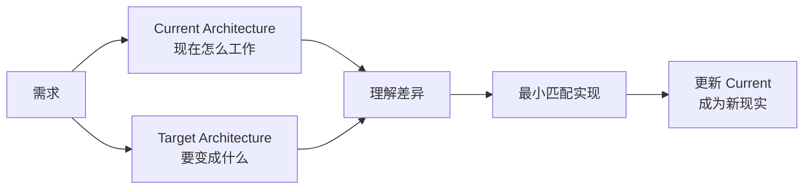
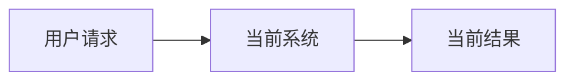
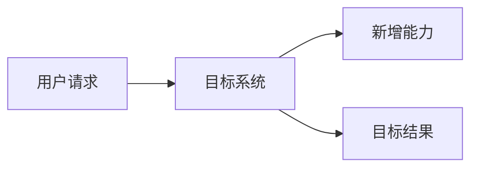

<div align="center">


# SuperDev

### 只用两张 Mermaid，让 AI 编码始终贴着架构走

**Current Architecture 说清现在，Target Architecture 说清下一步。然后让模型自己做事。**

[](https://github.com/fightheyyy/SuperDev)


[English](./README.en.md) · [30 秒看懂](#30-秒看懂) · [为什么只看两张图](#为什么只看两张图) · [快速开始](#快速开始)

</div>

---

SuperDev 是一个面向 **AI coding agent、Codex、Claude Code** 的软件架构工作流。

模型越来越强，真正稀缺的已经不是更多微观约束，而是准确的架构上下文。SuperDev 的设计思路可以压缩成两张可读的 Mermaid：

- **Current Architecture**：系统现在真实怎么工作。
- **Target Architecture**：这次修改要把系统带到哪里。

两张图足够清楚，agent 就能理解差异、完成实现，再把 Current 更新成新的现实。仓库现有的 `SPEC.md` / `PLAN.md` 规则负责组织和同步信息，但真正让模型理解系统的核心，始终是 Current / Target Architecture。

## 30 秒看懂



这两张图是给强模型的共享上下文：不限制它具体怎么写代码，只让它知道正在保护什么、准备改变什么。

## 为什么只看两张图

| 架构图 | 回答的问题 | 最重要的要求 |
|---|---|---|
| Current Architecture | 系统现在到底怎么工作？ | 必须忠于现有代码，不能画愿景 |
| Target Architecture | 这次修改要把系统带到哪里？ | 只表达当前方向，不画无限路线图 |

Current 和 Target 之间的差异，就是 agent 真正需要解决的问题。相比继续增加 prompt 规则，这种表达更短、更稳定，也更适合人和模型一起 review。

## 快速开始

### Codex

把仓库安装为本地 skill：

```bash
git clone https://github.com/fightheyyy/SuperDev.git ~/.codex/skills/superdev
```

然后在任务里调用：

```text
$superdev 按当前架构和目标架构完成这次改动。
```

### Claude Code / 其他 coding agent

- 将 [`CLAUDE.md`](./CLAUDE.md) 的规则合并到项目现有的 `CLAUDE.md`。
- 将 [`AGENTS.md`](./AGENTS.md) 的规则合并到项目现有的 `AGENTS.md`。

让对应的 coding agent 能读取这些说明即可。

## 最小模板

可以直接在项目的 `SPEC.md` 里使用这组最小结构：

````md
# Architecture

## Current Architecture



## Target Architecture


````

## Mermaid 怎么画才有用

- 优先使用 `flowchart LR`，让变化从左到右阅读。
- 画逻辑组件和关键关系，不要把文件树、方法名和调用日志搬进图里。
- 节点标签保持短小，整张图最好几秒内能扫完。
- Current 是现实，不是愿望；Target 是当前方向，不是无限路线图。
- 两张图尽量使用同样的布局，只突出真正发生变化的部分。

图的目标不是覆盖所有细节，而是让系统变化一眼可读。

## 什么时候适合用

适合：

- 长期维护的仓库或模块；
- 新能力改变了组件边界、数据流或依赖方向；
- 重构、迁移、平台化、adapter/runtime 变化；
- 未来还会有其他人或 agent 回来继续开发的系统。

不需要：

- typo、普通文案和依赖版本更新；
- 不改变逻辑结构的小 bug fix；
- 一次性脚本和随手实验。

## 仓库内容

- [`SKILL.md`](./SKILL.md)：可直接安装的 Codex skill。
- [`AGENTS.md`](./AGENTS.md)：Codex 和通用 coding agent 规则。
- [`CLAUDE.md`](./CLAUDE.md)：Claude Code 规则。
- [`agents/openai.yaml`](./agents/openai.yaml)：Codex skill 展示元数据。

## 和 SuperGoal 一起用

[SuperGoal](https://github.com/fightheyyy/SuperGoal) 负责把粗需求整理成清晰目标，SuperDev 负责让实现贴着架构走：

```text
粗需求 → SuperGoal 明确目标 → SuperDev 对齐 Current / Target → 实现
```

如果你也认为强模型需要的是清楚上下文，而不是更多流程，欢迎点一个 Star，让更多人看到这种更轻的 AI-assisted engineering 方式。
